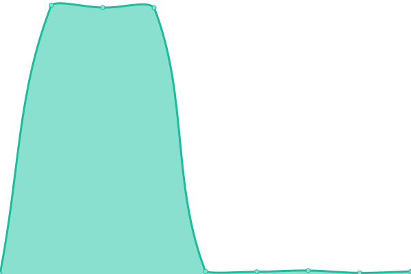

# [📈 Live Status](https://status.storest.io): <!--live status--> **🟧 Partial outage**

This repository contains the open-source uptime monitor and status page for [Storest](https://storest.io), powered by [Upptime](https://github.com/upptime/upptime).

With [Upptime](https://upptime.js.org), you can get your own unlimited and free uptime monitor and status page, powered entirely by a GitHub repository. We use [Issues](https://github.com/storestpos/upptime/issues) as incident reports, [Actions](https://github.com/storestpos/upptime/actions) as uptime monitors, and [Pages](https://status.storest.io) for the status page.

<!--start: status pages-->
<!-- This summary is generated by Upptime (https://github.com/upptime/upptime) -->
<!-- Do not edit this manually, your changes will be overwritten -->
<!-- prettier-ignore -->
| URL | Status | History | Response Time | Uptime |
| --- | ------ | ------- | ------------- | ------ |
|  [Api](https://api.storest.io/health) | 🟨 Degraded | [api.yml](https://github.com/storestpos/uptime/commits/HEAD/history/api.yml) | 

 19509ms
     
 | 

<a href="https://status.storest.io/history/api">0.00%</a>
    

|  [Application](https://app.storest.io/index.html) | 🟥 Down | [application.yml](https://github.com/storestpos/uptime/commits/HEAD/history/application.yml) | 

 0ms
     
 | 

<a href="https://status.storest.io/history/application">0.00%</a>
    

|  [Website](https://www.storest.io/index.html) | 🟨 Degraded | [website.yml](https://github.com/storestpos/uptime/commits/HEAD/history/website.yml) | 

 19507ms
     
 | 

<a href="https://status.storest.io/history/website">0.00%</a>
    

|  [Payments](https://api.storest.io/api/v1/payment/status) | 🟨 Degraded | [payments.yml](https://github.com/storestpos/uptime/commits/HEAD/history/payments.yml) | 

 19595ms
     
 | 

<a href="https://status.storest.io/history/payments">0.00%</a>
    

<!--end: status pages-->

[**Visit our status website →**](https://status.storest.io)

## 📄 License

- Powered by: [Upptime](https://github.com/upptime/upptime)
- Code: [MIT](./LICENSE) © [Storest](https://storest.io)
- Data in the `./history` directory: [Open Database License](https://opendatacommons.org/licenses/odbl/1-0/)
